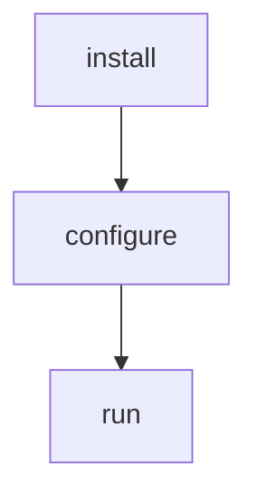

# Setup

This document links nowhere, so the graph keeps it as an isolated node.

The diagram below is rendered by the reader's bundled engine, not at build time:

```mermaid
graph TD;
    install-->configure;
    configure-->run;
```
